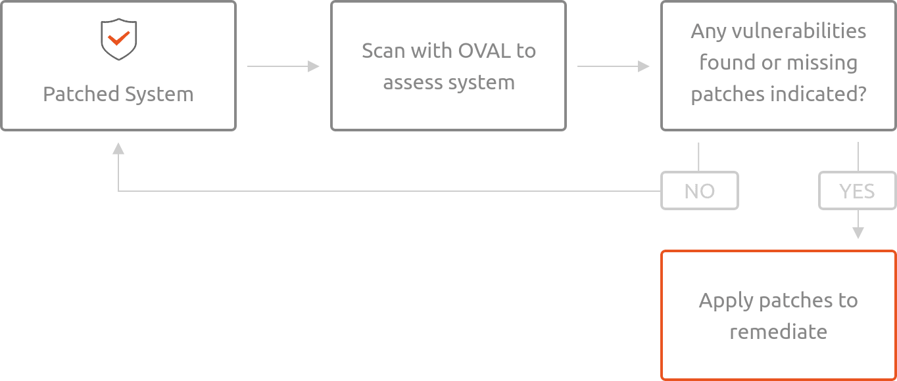

How Ubuntu OVAL data works
##########################

As software vulnerabilities are discovered, they are assigned CVE identifiers by MITRE and other organizations. Canonical triages these CVEs to determine whether the vulnerabilities affect software distributed within Ubuntu. The results of this triage are then used to generate the CVE OVAL. The CVE OVAL can be used to assess the local system for vulnerabilities.

When the Ubuntu Security Team patches software to address one or more CVEs, an Ubuntu Security Notice (USN) is published announcing the update. The USN OVAL data is generated from information encapsulated within the USN, and can be used to assess the system for missing patches.

