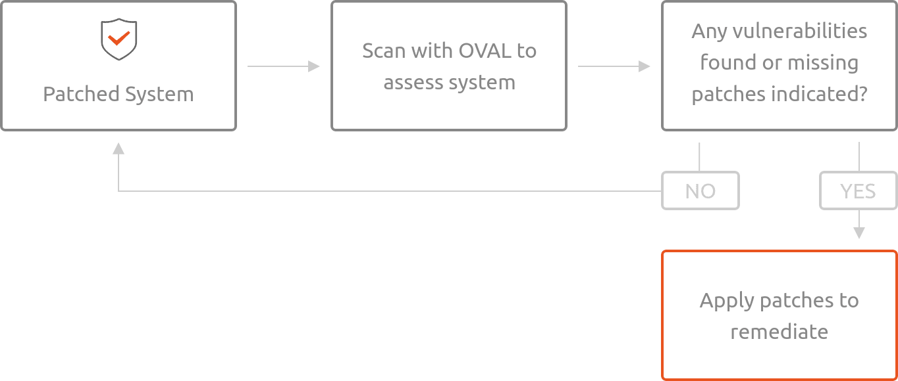

.. Source: https://ubuntu.com/security/oval

Ubuntu OVAL data
################

Canonical’s Security Team produces Ubuntu OVAL, a structured, machine-readable dataset for all supported Ubuntu releases. It can be used to evaluate and manage security risks related to any existing Ubuntu components. It is based on the Open Vulnerability and Assessment Language (OVAL). 

How Ubuntu OVAL data works
==========================

As software vulnerabilities are discovered, they are assigned CVE identifiers by MITRE and other organizations. Canonical triages these CVEs to determine whether the vulnerabilities affect software distributed within Ubuntu. The results of this triage are then used to generate the CVE OVAL. The CVE OVAL can be used to assess the local system for vulnerabilities.

When the Ubuntu Security Team patches software to address one or more CVEs, an Ubuntu Security Notice (USN) is published announcing the update. The USN OVAL data is generated from information encapsulated within the USN, and can be used to assess the system for missing patches.

Using Ubuntu’s OVAL data
========================

Using OpenSCAP
---------------

1. Download the compressed XML:

.. code-block:: bash

    wget https://security-metadata.canonical.com/oval/com.ubuntu.$(lsb_release -cs).usn.oval.xml.bz2

2. Uncompress the data:

.. code-block:: bash
    
    bunzip2 com.ubuntu.$(lsb_release -cs).usn.oval.xml.bz2

3. Use OpenSCAP to evaluate the OVAL and generate an html report:

.. code-block:: bash
    
    oscap oval eval --report report.html com.ubuntu.$(lsb_release -cs).usn.oval.xml

4. The output is generated in the file report.html, open it using your browser:

.. code-block:: bash
    
    xdg-open report.html

5. File naming convention:

.. code-block:: bash
    
    com.ubuntu.<example release name>.usn.oval.xml.bz2

Scanning an Official Cloud Image
--------------------------------

To scan an Ubuntu Official Cloud Image for known vulnerabilities, the manifest file and xml data can be used together. Unlike above where we were able to use the lsb_release command, you will need to manually enter the URL for the OVAL data.

.. Note:: In the example below we are using focal/20.04, you would replace ‘focal’ with the version you are inspecting.

1. Download an Ubuntu image:

.. code-block:: bash
    
    wget https://security-metadata.canonical.com/oval/oci.com.ubuntu.focal.usn.oval.xml.bz2
    bunzip2 oci.com.ubuntu.focal.usn.oval.xml.bz2

2. Download the manifest file for the image

.. code-block:: bash
    
    wget -O manifest https://cloud-images.ubuntu.com/releases/focal/release/ubuntu-20.04-server-cloudimg-amd64-root.manifest

3. Use OpenSCAP to evaluate the OVAL and generate an html report

.. code-block:: bash
    
    oscap oval eval --report report.html oci.com.ubuntu.focal.usn.oval.xml

4. The output is generated in the file report.html, open it using your browser

.. code-block:: bash
    
    xdg-open report.html

5. File naming convention:

.. code-block:: bash
    
    oci.com.ubuntu.<example release name>.usn.oval.xml.bz2

Ubuntu OVAL data parameters
===========================

.. csv-table:: 
    :header: "Parameter", "Description"
    
    "CVE_ID", "CVE number as reported by MITRE"
    "USN", "Corresponding Ubuntu Security Notice"
    "Description", "A short description of the security risk addressed"
    "Severity", "CVE or USN severity as defined by the Ubuntu Security team"
    "Affected Platform", "Affected Ubuntu release(s), incl ESM"
    "Title", "CVE number, affected Ubuntu release(s), and Severity"
    "Public date", "The date on which a CVE was publicly announced"
    "Public date of USN", "The date on which a USN was published"
    "Reference", "Links to more information about the issue"
    "BugReport", "Link to bugreport about the issue"    

.. NOTE:: The above parameters are included in the OVAL xml file, but not all are shown in the resulting generated OpenSCAP report.

