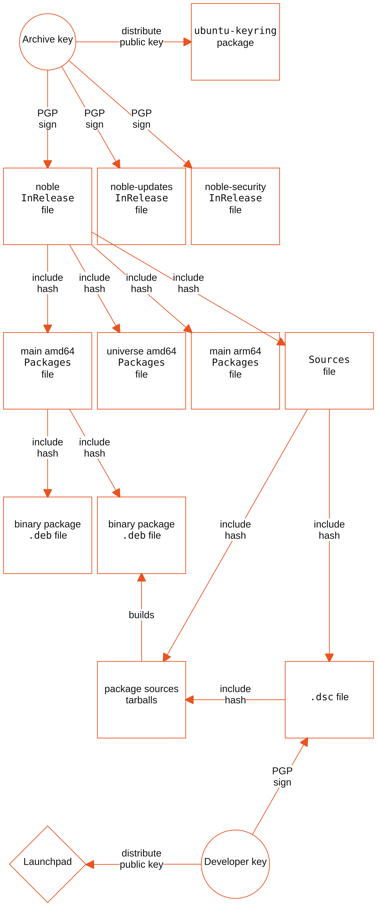

Ubuntu archive integrity verification
#####################################

The Ubuntu Archive distributes packages over a variety of protocols and from
third-party mirrors. We decouple the authenticity of packages from the
distribution method used. This is achieved through cryptographic signatures
generated on systems independent of the distribution infrastructure. APT
automatically uses these signatures to verify the integrity of downloaded
software packages.

This architecture has several benefits:

* **Tampering protection**: It provides protection even in absence of 
  in-transit security through TLS.
* **Redistribution integrity**: You can verify the integrity of packages 
  even when they are redistributed by third parties.
* **Reduced attack surface**: The Ubuntu Archive can't distribute malicious
  software.

This verification scheme is inherited from Debian, Ubuntu's upstream distribution.
As such, most of the content in this section also applies to Debian installations. 
However, the infrastructure for distributing the official Ubuntu Archive and 
`Launchpad <https://launchpad.net/>`_ is completely independent of the Debian
infrastructure.

You should only configure trusted respositories as APT
`sources <https://manpages.ubuntu.com/manpages/man5/sources.list.5.html>`_.
There is no automatic mechanism to establish the trustworthiness of a
repository, with well-intentioned and malicious actors alike being able to set
up repositories compatible with APT or `PPAs on Launchpad
<https://help.launchpad.net/Packaging/PPA>`_.

Automatic verification
======================

Any frontend to APT will automatically apply the same validation rules,
including ``apt``, ``apt-get``, ``aptitude`` or any of the Ubuntu graphical
applications. You can manage this behavior through APT `configuration
<https://manpages.ubuntu.com/manpages/man5/apt.conf.5.html>`_ and its `sources
<https://manpages.ubuntu.com/manpages/man5/sources.list.5.html>`_.

Recommended process
-------------------

Always allow the package manager to download and verify the integrity of the
software packages. This means invoking the commands with a package name, and not
a ``.deb`` filename.

The following is the recommended practice, when using ``apt``:

.. code-block:: bash

   apt install packagename

This alternative invocation does not verify the integrity of the package:

.. code-block:: bash

   apt install ./packagename_1.0.0_all.deb

Establish supplier trust
------------------------

It is crucial that you establish trust in the owners of an alternative package
archive, such as a PPA, before you install any software from them. As part of
the installation, upgrades or removal, the software will execute code with
elevated privileges (as ``root``).

Ubuntu distributes a large collection of software packages in its official
Ubuntu Archive to simplify this provisioning task.

Insecure settings
-----------------

There are a number of APT configuration settings that we don't recommended, as
they disable the verification checks described in this section. These can be
configured in ``/etc/apt/apt.conf`` (or the file specified in
``Dir::Etc::main``), ``/etc/apt/apt.conf.d/`` (or the path specified in
``Dir::Etc::Parts``), the file specified by the ``APT_CONFIG`` environment
variable, or directly passed on the command-line to a package manager.

.. warning::
   **Security risk**

   Pay particular attention to the following settings. You should only consider
   these acceptable in specific environments once you fully understand their
   implications:

   * The ``Trusted`` option for an APT sources entry, if set to ``yes``, as
     verification checks will be disabled.
   * ``APT::Get::AllowUnauthenticated``, if set to ``yes``.
   * ``Acquire::AllowInsecureRepositories``, if set to ``yes``.
   * ``Acquire::AllowDowngradeToInsecureRepositories``, if set to ``yes``.

Trust anchor
------------

Unless verification is disabled, APT validates each configured source against
a trust anchor, configured as a GPG keyring. A global trusted keyring serves
as a fallback and can be managed through ``apt-key``, but this functionality 
has been deprecated since Ubuntu 22.04 LTS (Jammy Jellyfish).

We recommend that you only configure the Ubuntu Archive trust anchor in the
global trusted keyring. Other repositories should reference individual keyrings
stored in ``/etc/apt/keyrings/`` (when configured by the system administrator) or
``/usr/share/keyrings/`` (when configured by a package) through the `sources
<https://manpages.ubuntu.com/manpages/man5/sources.list.5.html>`_ configuration.

Alternatively, you can embed the trust anchor in the sources configuration, as the
following example demonstrates for a hypothetical PPA:

.. code-block:: none

    Types: deb
    URIs: https://ppa.launchpadcontent.net/ubuntu-security/demo/ubuntu/
    Suites: noble
    Components: main
    Signed-By: 
     -----BEGIN PGP PUBLIC KEY BLOCK-----
     .
     mQINBGbXMpEBEADdAP7i2KzwrStkf3qh64HZTeq2XbhhEIXbNLGn4sZDMtK1cHiH
     ...

A configured repository that doesn't reference a trust anchor through the
``Signed-By`` option will use the global trusted keyring. The global trusted
keyring is bootstrapped by the ``ubuntu-keyring`` package, which is installed by
default and creates GPG keyrings containing the Ubuntu Archive signing public
keys under the ``/etc/apt/trusted.gpg.d/`` directory.

Signature scheme

..
   Mermaid code for diagram:
   ---
   config:
       theme: 'base'
       themeVariables:
           primaryColor: '#ffffff'
           lineColor: '#e95420'
           secondaryColor: '#ffffff'
           primaryTextColor: '#111111'
           primaryBorderColor: '#e95420'
   ---
   block-beta
    columns 4
        AK(("Archive key")) space:1
        P["<code>ubuntu-archive</code> package"] space:1
        space:4
        R1["noble <code>InRelease</code> file"]
        R2["noble-updates <code>InRelease</code> file"]
        R3["noble-security <code>InRelease</code> file"]
        space:1
        space:4
        P1["main amd64 <code>Packages</code> file"]
        P2["universe amd64 <code>Packages</code> file"]
        P3["main arm64 <code>Packages</code> file"]
        S["<code>Sources</code> file"]
        space:4
        DEB1["binary package <code>.deb</code> file"]
        DEB2["binary package <code>.deb</code> file"]
        space:2
        space:4
        space:1
        SRC["package sources tarballs"]
        space:1
        DSC["<code>.dsc</code> file"]
        space:4
        LP{"Launchpad"}
        space:1
        DK(("Developer key")) space:1
        AK-- "distribute public key" -->P
        AK-- "PGP sign" -->R1
        AK-- "PGP sign" -->R2
        AK-- "PGP sign" -->R3
        R1-- "include hash" -->P1
        R1-- "include hash" -->P2
        R1-- "include hash" -->P3
        R1-- "include hash" -->S
        P1-- "include hash" -->DEB1
        P1-- "include hash" -->DEB2
        S-- "include hash" -->SRC
        S-- "include hash" -->DSC
        SRC-- "builds" -->DEB2
        DSC-- "include hash" -->SRC
        DK-- "PGP sign" -->DSC
        DK-- "distribute public key" -->LP

The following diagram depicts the Ubuntu Archive signature scheme:

The Ubuntu Archive keys use an embedded PGP signature in the ``InRelease`` file
associated with each archive pocket. For example, for the Ubuntu 24.04 LTS
(Noble Numbat) security pocket, the InRelease file can be found at
https://archive.ubuntu.com/ubuntu/dists/noble-security/InRelease. As of January
2026, the Archive keys use 4096-bit RSA. If the ``InRelease`` file were to be
tampered with, its PGP signature would no longer match.

The ``InRelease`` file contains cryptographic hashes for a number of metadata
files, including a ``Packages`` file for each component (Main, Restricted,
Universe and Multiverse) and each architecture. The cryptographic hashes use
various algorithms, such as SHA2-256. For example, the Ubuntu 24.04 LTS (Noble
Number) security pocket amd64 Main ``Packages`` file is located at
https://archive.ubuntu.com/ubuntu/dists/noble-security/main/binary-amd64/Packages,
with its hash included in the signed ``InRelease`` file. If the ``Packages``
file were to be tampered with, its hash would no longer match the one present in
the ``InRelease`` file. If the ``InRelease`` file were to be adjusted with the
modified hash, this change would be detected by the aforementioned PGP signature
verification.

The ``Packages`` file contains the relative filename of the ``.deb`` package for
the latest version, as well as cryptographic hashes of the contents of the
``.deb`` file. The cryptographic hashes use various algorithms, such as SHA2-256
and SHA2-512. If the contents of a ``.deb`` file were to be tampered with, its
hash would no longer match the one present in the ``Packages`` file. If the
``Packages`` file were to be adjusted with the modified hash, this change would
be detected by the aforementioned process.

Scheme strength
---------------

This security measure depends on the second-preimage resistance of the
cryptographic hash functions used. Even though multiple hash functions are used,
it is sufficient for one of them to have this quality to ensure that integrity
attacks can be detected. The Ubuntu Archive ensures that functions without known
weaknesses are used for this purpose.

Validating old versions
-----------------------

The ``InRelease`` and ``Packages`` files are regenerated when a new version of a
package is uploaded and only reference the newest version. It is still possible
to verify the integrity of a previously downloaded package by using the `Ubuntu
Snapshot <https://snapshot.ubuntu.com/>`_ service.

Validating sources
------------------

You can take this process one step further and verify the identity of the team
member that uploaded a specific package. Ubuntu developers upload source
packages, which are then built on `Launchpad <https://launchpad.net/>`_, before
having the binary ``.deb`` packages copied over to the Archive and the metadata
files (including the ``InRelease`` and ``Packages`` files) regenerated and
signed with the Ubuntu Archive keys.

Similarly to the ``Packages`` file, each component of a release pocket will have
a hash-verified ``Sources`` file referenced by the ``InRelease`` file. The
``Sources`` file follows the same format as the ``Packages`` file, but instead
points to the package’s sources (as compressed tarballs) and a ``.dsc`` file;
cryptographic hashes of both of these are included in the ``Sources`` file. The
``.dsc`` file contains, amongst others, three pieces of information: a reference
to the same source tarballs mentioned before, their cryptographic hashes and,
most importantly, a PGP signature of the ``.dsc`` file itself generated by the
individual uploader with their own private key. The corresponding public keys
are available on the `Ubuntu Keyserver <https://keyserver.ubuntu.com/>`_ and
associated with the developers’ individual `Launchpad <https://launchpad.net/>`_
accounts. Given the non-repudiation property of digital signatures, this scheme
provides a tamper-proof audit trail for all packages available on the Ubuntu
archive.
